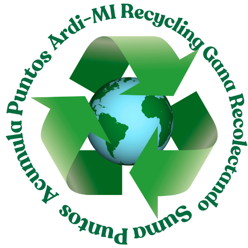
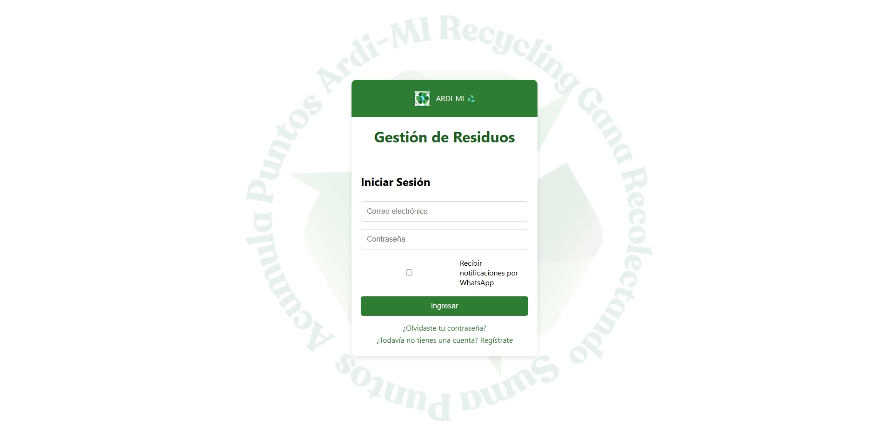
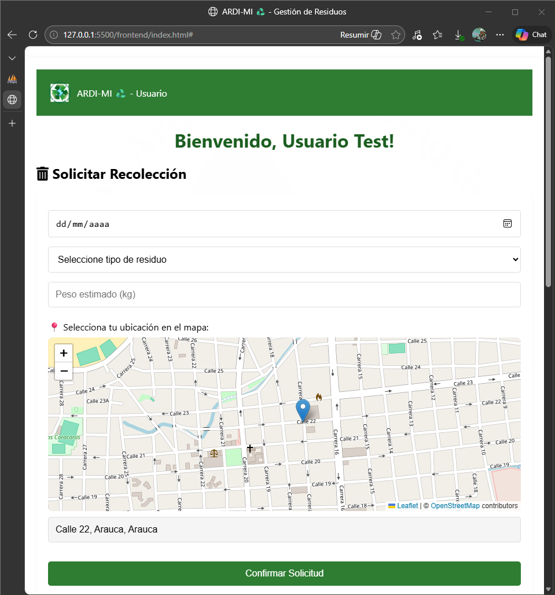
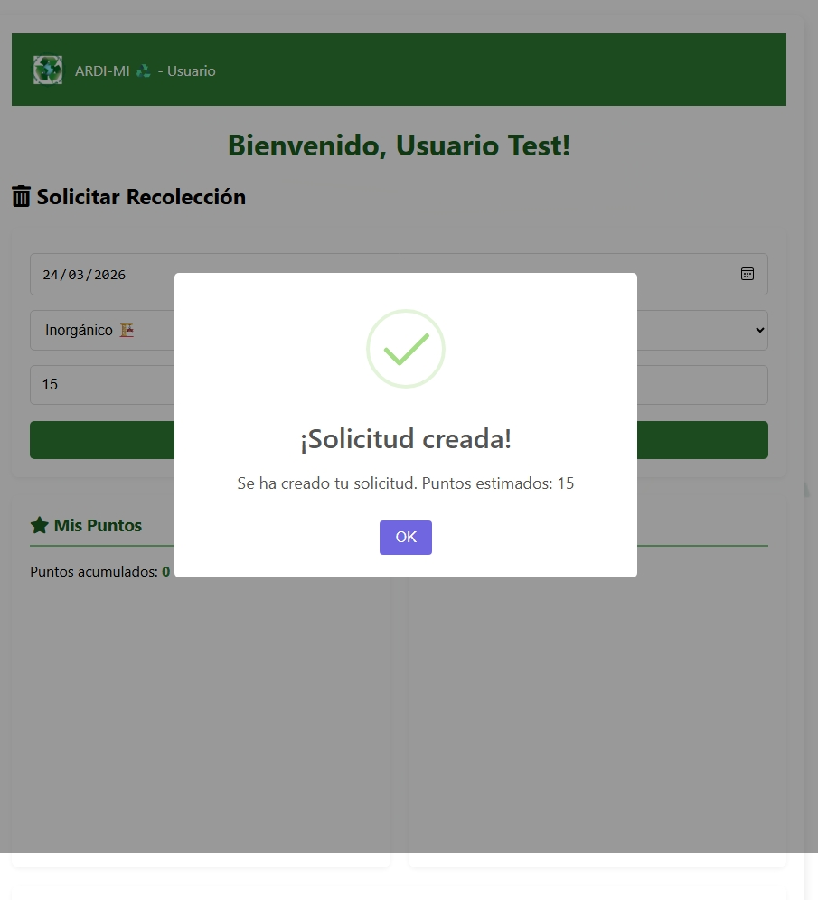
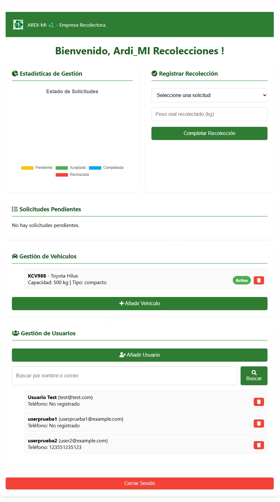
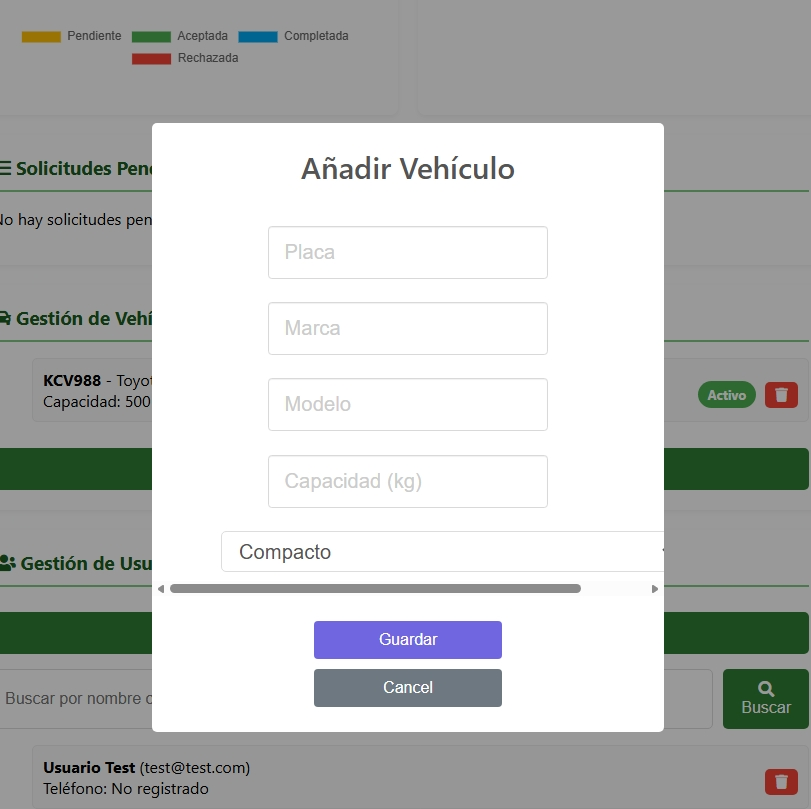

# ♻️ ARDI-MI - Administración Responsable de Desechos Integrales y Manejo Inteligente

> **🔒 Repositorio Privado**  
> Este código es propiedad de ARDI-MI y no está disponible para uso público.  
> El acceso está restringido exclusivamente al equipo de desarrollo autorizado.

---

## 🏢 Sobre la Compañía

**ARDI-MI** es una empresa dedicada a la **recolección de residuos sólidos** en hogares y comunidades.  
Trabajamos bajo un modelo de suscripción, donde cada hogar o familia contratante tiene derecho a solicitar la recolección de sus desechos de manera ágil, responsable y sostenible.

Nuestro sistema tecnológico permite:

- Gestionar solicitudes de recolección desde los hogares.
- Administrar la flota de vehículos recolectores.
- Asignar rutas de recogida eficientes.
- Calcular puntos por reciclaje para fomentar la cultura ambiental.
- Generar reportes y estadísticas en tiempo real.

---

## 🧩 Funcionalidades del Sistema

### 👤 Para los Usuarios (Hogares)

- **Registro e inicio de sesión** con autenticación segura.
- **Crear solicitudes de recolección** seleccionando:
  - Tipo de residuo (orgánico, inorgánico, reciclable, peligroso)
  - Peso aproximado
  - Ubicación en mapa interactivo (arrastrando un marcador)
- **Historial de solicitudes** con estados: pendiente, aceptada, completada, rechazada.
- **Acumulación de puntos** por cada kg recolectado.
- **Gráfico de puntos** para visualizar el historial de aportes ambientales.
- **Notificaciones en tiempo real** sobre el estado de sus solicitudes.

### 🏭 Para la Empresa (ARDI-MI)

- **Panel administrativo** con vista general del sistema.
- **Gestión de solicitudes pendientes**: aceptar, rechazar o completar recolecciones.
- **Registro de peso real** al completar una recolección (asignación automática de puntos).
- **Gestión de vehículos recolectores**: CRUD completo (placa, marca, modelo, capacidad, tipo).
- **Gestión de usuarios registrados** en la plataforma.
- **Estadísticas visuales** con gráficos de estado de solicitudes.
- **Asignación de rutas** según disponibilidad de vehículos.

---

## 🛠️ Tecnologías Utilizadas

| Capa | Tecnología |
|------|------------|
| **Frontend** | HTML5, CSS3, JavaScript (Vanilla), Leaflet (mapas), Chart.js, SweetAlert2, Toastify |
| **Backend** | Python, FastAPI, Uvicorn |
| **Base de Datos** | MySQL, SQLAlchemy (ORM) |
| **Autenticación** | JWT, bcrypt |
| **Geolocalización** | OpenStreetMap + Leaflet |

---

## 📁 Estructura del Proyecto
ARDI-MI/
├── frontend/ # Interfaz de usuario
│ ├── index.html
│ ├── script.js
│ ├── styles.css
│ └── images/
│
├── ardimi_api/ # Backend FastAPI
│ ├── app/
│ │ ├── auth/ # Autenticación JWT
│ │ ├── models/ # Modelos SQLAlchemy
│ │ ├── routes/ # Endpoints de la API
│ │ ├── schemas/ # Esquemas Pydantic
│ │ ├── database.py
│ │ └── main.py
│ ├── requirements.txt
│ ├── .env
│ └── database.sql
│
└── README.md

text

---

## 🖥️ Pantallas del Sistema

### Inicio de Sesión

### Dashboard del Usuario

### Creación de solicitud

### Dashboard de la Empresa

### Gestión de vehículos

---